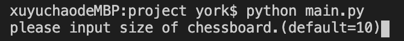

# 667_project
The project for CIS667, Introduction to Artificial Intelligence

# Requirements
Python 3.x
Numpy

# How ro run
Just simply open the terminal and type 'python main.py'
Then you will see:

