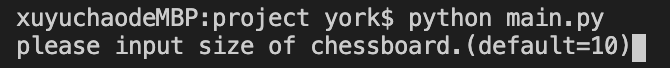
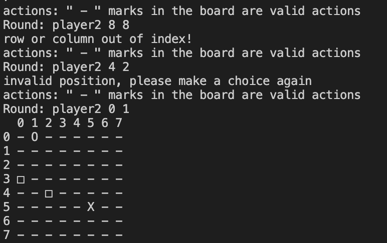

# 667_project
The project for CIS667, Introduction to Artificial Intelligence

# Requirements
Python 3.x
Numpy

# How ro run
Just simply open the terminal and type 'python main.py'
Then you will see:

It requires you to type a number to decide the board size (If size selected is smaller than 5, there will be a warning that there will be no winner).
For example I choose size 8:

Then player1 should put their stone first. Simply type two number separated with space, such as:

It input 5 5 and a stone 'x' has been put on (5,5) position on the board.
Then it is player2 turn. You can see if I choose (8,8) or (2,5), both of them will print an error message since (8,8) out of board size and (2,5) is the obstacle position:

Follow the same steps, after several rounds, we can see, for instance:

When player1 put stone on (5,1), he will be the winner since he get 5 stones in a row
