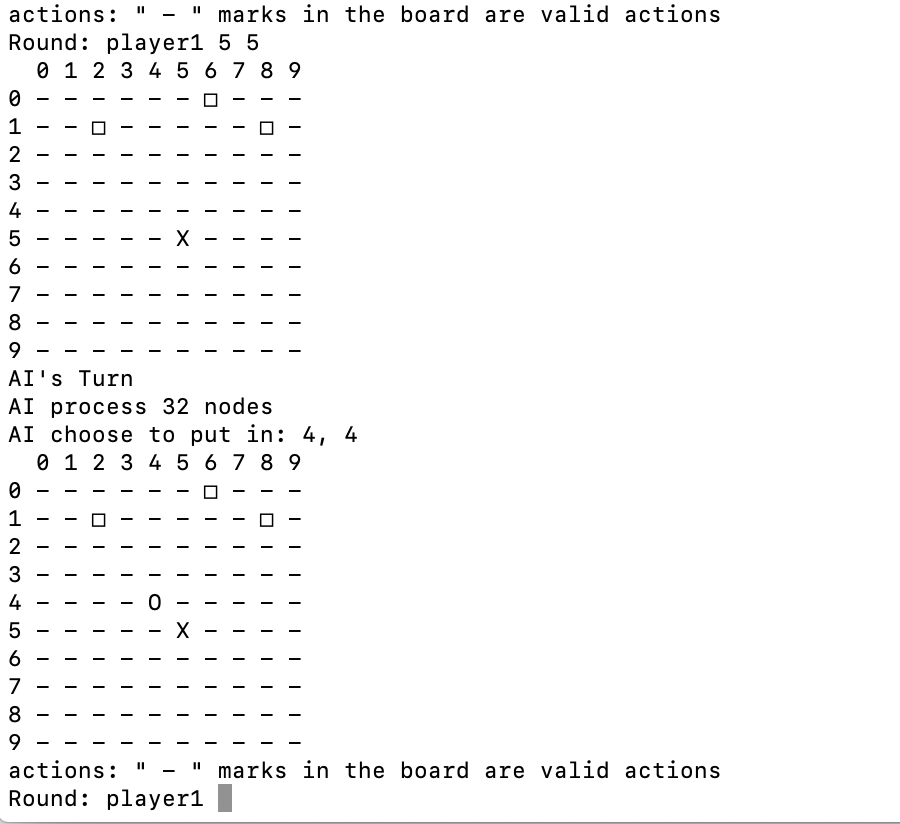

# 667_project
The project for CIS667, Introduction to Artificial Intelligence

# Requirements
Python 3.x 
Numpy

# Pattern
Player vs AI

# How ro run
Put main.py and treenew.py in the same directory and then open the terminal and type 'python main.py' 
 
It requires you to type a number to decide the board size (If size selected is smaller than 5, there will be a warning that there will be no winner). 
And it also needs you to choose an AI type. Tree AI is what our team designed and baseline AI chooses actions uniformly at random. 
Then a hint will be displayed that '-' marks in the board are valid actions. 
Then player1 should put their stone. Simply type two number separated with space, such as: 
 
It input 5 5 and a stone 'x' has been put on (5,5) position on the board. 
Then it is AI turn. AI will calculate the score and choose the position with the highest score so far. 
Follow the same steps, after several rounds, we can see, for instance: 
 
When player1 put stone on (2,1), he will be the winner since he get 5 stones in a row 
